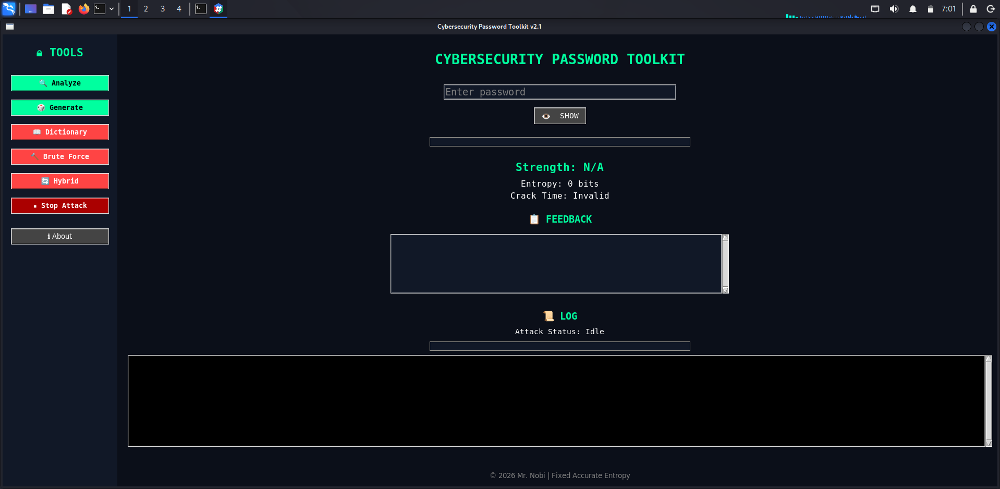

# Password Strength Toolkit

Cybersecurity password checker with real-time analysis, attack demos, and integrity protection.

**Developer:** Mr.nobi

## Highlights

- Password strength score (`0-100`)
- Labels: `WEAK`, `MODERATE`, `STRONG`
- Entropy + crack-time estimate
- Secure password generator
- Show/Hide password input
- Attack demos:
  - Dictionary
  - Brute Force (demo-limited)
  - Hybrid
- Attack progress bar + status + stop button
- Startup integrity check using hash manifest

## How The Tool Works

- User password input is analyzed in real-time.
- Scoring model combines:
  - length
  - character variety (lower/upper/digits/symbols)
  - entropy estimate
  - penalty rules for weak patterns
- Pattern detection includes:
  - common passwords
  - predictable substitutions (like `P@ssw0rd`)
  - keyboard sequences (`qwerty`, `1234`)
  - repeated patterns (`aaaa`, `abcabc`)
  - year/date patterns (`2024`, `1999`)

## Attack Simulation Modules

- **Dictionary Attack**
  - Checks password against common-word list.
  - Includes normalized matching for simple l33t substitutions.
- **Brute Force Attack**
  - Educational demo mode (capped for performance).
  - Uses character-set based guessing with attempt limit.
- **Hybrid Attack**
  - Tries `word + number` patterns and simple separators (`_`, `!`, `@`).
  - Useful to demonstrate real-world weak password behavior.

## Security Layer (Integrity Check)

- On startup, tool verifies hashes from `password_tool.manifest.json`.
- If mismatch detected:
  - default mode: warning + app still runs
  - strict mode: app startup blocked
- Enable strict mode:

```bash
PASSWORD_TOOL_STRICT_INTEGRITY=1 python3 password_tool.py
```

## Who This Project Is For

- Cybersecurity students
- Password policy demonstrations
- Security awareness sessions
- Educational mini-labs for weak password attack patterns

## Files

- `password_tool.py` - main app
- `password_tool.manifest.json` - integrity hashes
- `update_manifest.py` - regenerate manifest after code edits
- `benchmark_password_tool.py` - benchmark runner
- `password_benchmark_dataset.json` - benchmark dataset

## Run

```bash
python3 password_tool.py
```

## Requirements

- Python `3.10+`
- Tkinter (usually bundled with Python desktop installs)

## Recommended Demo Flow

1. Run app and enter a weak password (example: `password123`).
2. Show score/feedback panel change in real-time.
3. Run dictionary/hybrid attack and observe progress + status.
4. Generate a secure password and compare score.
5. Show strict integrity mode behavior (optional).

## Update Manifest (after code change)

```bash
python3 update_manifest.py
```

## Benchmark

```bash
python3 benchmark_password_tool.py --use-saved-dataset
```

## Screenshots

Add your screenshots in a `screenshots/` folder, then they will render on GitHub.

Suggested files:

- `screenshots/main-ui.png`
- `screenshots/attack-progress.png`
- `screenshots/strength-feedback.png`

Markdown preview links:

```md



```

## Troubleshooting

- If integrity warning appears after editing code, run:

```bash
python3 update_manifest.py
```

- If brute force shows limit/cap message, that is expected in demo mode.
- If Tkinter error appears, confirm Python installation includes Tk support.
